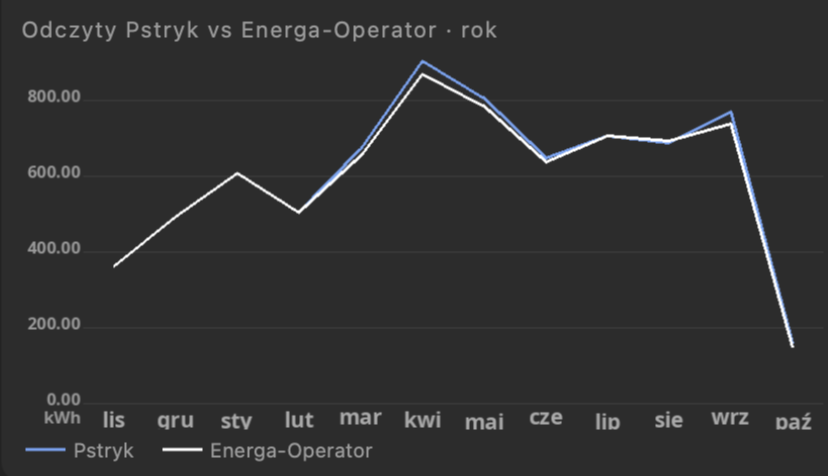

# Energa Mój Licznik — import zużycia energii

> **Fully coded by Claude AI** — not a single line of code was written manually by a human.

Pobiera **godzinowe zużycie energii** z portalu Energa Operator **Mój Licznik** i zapisuje je do MySQL / MariaDB (albo wypisuje jako CSV). Bez przeglądarki, bez Pythona, bez bibliotek — jeden plik PHP + dwa skrypty.

Energa Operator udostępnia zużycie **co do godziny**. Mając te dane u siebie, możesz np.:

- zrobić offline **symulację rachunków** w różnych wariantach — taryfy G11 / G12 / G12w, różni sprzedawcy, **ceny dynamiczne** (TGE, Pstryk itp.),
- **porównać pomiary** licznika Energa z własnym miernikiem (Pstryk, Shelly, licznik na DIN itp.),
- policzyć, ile energii zużywasz w poszczególnych godzinach, dniach i miesiącach.

### Przykład zastosowania — TymOS

Tak wykorzystuję te dane w [TymOS](https://github.com/tymoteuszrogalewski/tymos), moim systemie automatyki domowej:


*Rzeczywiste godzinowe zużycie z Mój Licznik przeliczone przez trzy warianty: ceny dynamiczne Pstryk, taryfa Energa G11 i G12r — miesiąc po miesiącu.*



*Porównanie pomiarów: licznik operatora (Energa) i pomiar Pstryka.*

*English: hourly electricity consumption import from the Polish DSO portal Energa Operator "Mój Licznik" into MySQL/MariaDB or CSV.*

<h3>Co potrafi:<br>dane godzinowe · pobór A+ · oddanie do sieci A- (PV) · taryfy G11 / G12 / wielostrefowe · cała historia · CSV albo baza</h3>

## Pliki

```
go.sh               pobiera wczoraj i dziś — do crona
history.sh          pobiera całą historię dzień po dniu (np. rok, dwa lata)
energa.inc.php      biblioteka: logowanie, pobranie dnia, zapis
energa_day.php      to, co uruchamia go.sh
energa_history.php  to, co uruchamia history.sh
config.example.php  wzór konfiguracji
schema.sql          tabela energa_hourly
```

## Wymagania

- PHP 7.4+ z rozszerzeniami `curl` i `mysqli` (na Debianie / Raspberry Pi OS: `apt install php-cli php-curl php-mysql`)
- konto w [Mój Licznik](https://mojlicznik.energa-operator.pl) z licznikiem zdalnego odczytu
- MySQL / MariaDB — opcjonalnie (bez bazy dane lecą jako CSV)

## Instalacja

```bash
git clone https://github.com/tymoteuszrogalewski/energa-mojlicznik.git
cd energa-mojlicznik
cp config.example.php config.php
nano config.php                     # login, hasło, dane bazy
mysql energa < schema.sql           # tylko przy zapisie do bazy
```

Numer licznika (`meterPoint`) zostaw pusty — skrypt wykryje go sam po zalogowaniu.

## Użycie

```bash
./go.sh                             # wczoraj + dziś
./go.sh 2026-10-05                  # jeden wybrany dzień
./history.sh 2025-01-01             # od 1 stycznia 2025 do dziś
./history.sh 2025-01-01 2025-12-31  # wybrany zakres
```

Historię można przerwać i uruchomić ponownie — wiersze się nadpisują, nic się nie dubluje. Między dniami jest przerwa (`ENERGA_PAUSE`, domyślnie 2 s), żeby nie obciążać portalu. Rok historii pobiera się kilkanaście minut.

Energa udostępnia dane mniej więcej od montażu licznika zdalnego odczytu — dla starszych dni portal zwraca pustą odpowiedź (`0 godzin`).

**Cron** — co godzinę (Energa uzupełnia dane z opóźnieniem, więc dzisiejsze godziny dochodzą stopniowo):

```
5 * * * *  /sciezka/energa-mojlicznik/go.sh >/dev/null
```

**Tryb CSV** — ustaw `DB_NAME` na `''` (kolumny: ts_utc; ts_local; kwh_import; kwh_export):

```
2026-10-04 22:00:00;2026-10-05 00:00:00;0.765;
```

## Tabela

| kolumna | znaczenie |
|---|---|
| `ts_utc` | początek godziny, UTC (klucz) |
| `ts_local` | początek godziny, czas polski — `14:00` = zużycie 14:00–15:00 |
| `kwh_import` | pobór z sieci (A+), kWh |
| `kwh_export` | oddanie do sieci (A-), kWh — gdy `ENERGA_EXPORT = true` |

Kluczem jest czas UTC, bo przy zmianie czasu na zimowy godzina 02:00 występuje dwa razy (doba ma 25 godzin).

```sql
-- zużycie dzienne
SELECT DATE(ts_local) dzien, SUM(kwh_import) kwh
FROM energa_hourly GROUP BY dzien ORDER BY dzien DESC;
```

## Uwagi

- Mój Licznik nie ma oficjalnego API — skrypt loguje się jak przeglądarka. Jeśli Energa zmieni portal, skrypt może przestać działać.
- **Blokada / CAPTCHA** — portal może czasem zablokować logowanie skryptu i zażądać CAPTCHA. Dzieje się tak np. po kilku próbach z błędnym loginem lub hasłem albo po przekroczeniu limitu zapytań. Wtedy zaloguj się na konto przez przeglądarkę **z tego samego adresu IP**, z którego działa skrypt, i przepisz CAPTCHA. Potem uruchom skrypt ponownie — przy pobieraniu historii podaj datę dnia, na którym się zatrzymał, i pobieranie potoczy się dalej.
- Na koncie z kilkoma licznikami automatycznie wybierany jest pierwszy — inny wpisz w `ENERGA_METER`.

## Pochodzenie

Moduł wydzielony z [TymOS](https://github.com/tymoteuszrogalewski/tymos) — lekkiego systemu automatyki domowej na Raspberry Pi.

## Licencja

MIT — patrz [LICENSE](LICENSE).
